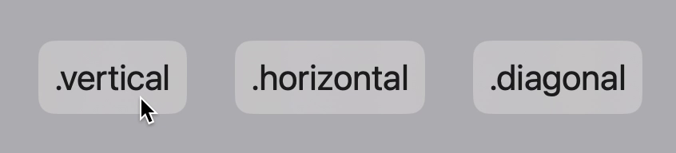

# About
**Anitom**, aka *Animation Atom*, is an open-source library for animation effects based on SwiftUI. It aims to provide stunning advanced animation effects to developers with simple and understandable code, all built on Swift. 

Currently, the project is in its **early stages** and undergoing refinement of its content. Therefore, it is not yet ready to be integrated into your project. However, I will strive to develop and improve this animation library as soon as possible. Once the basic development is complete, I will release the first usable version. 

> As a college student, my understanding of Swift and SwiftUI may not be extensive, so I welcome any feedback or corrections from anyone.

# UI Elements

## ReversibleCard

**ReversibleCardr**, by combining `.scaleEffect()`, `.rotationEffect()` and `.rotation3DEffect()` effects, allows a view to appear as a reversible card. You can customize both `front` and `back` view, as well as the way the action triggers. The builtin background is Material, however, you should diasble it if target devices are lack of GPU performance.

<table>
  <thead>
    <tr>
      <th>Preview</th>
      <th>Good Example</th>
    </tr>
  </thead>
  <tbody>
    <tr>
      <td></td>
      <td></td>
    </tr>
  </tbody>
</table>

### Declaration

```swift
struct ReversibleCard: View {
    init(orientation: AnitomOrientation, useBuiltinBackgrounds: Bool = true, tapToFlip: Bool = true, front: @escaping () -> some View, back: @escaping () -> some View) {}
    
    @State var isFlipped = false
    var useBuiltinBackgrounds = true
    var tapToFlip = true
    private var flipConfig: (CGFloat, CGFloat, CGFloat, CGFloat, CGFloat, CGFloat)
    var front: AnyView
    var back: AnyView
    var body: some View {}
    
    func makeEmptyView() -> some View {}
}
```

### Usage
```swift
ReversibleCard(orientation: .vertical, useBuiltinBackgrounds: true, tapToFlip: true){
    VStack{
        Text(".vertical")
            .font(.title)
    }
}back: {
    VStack{
        Text(".vertical")
            .font(.title)
    }
}
```
### Restriction
Under this mode, only `.vertical`, `.horizontal`, and `.diagonal` of `AnitomOrientation` is allowed, otherwise your app crashes.

Please also make sure that the bounds of both sides are similiar, or the card behaves wierd. Use fixed `.frame(x: CGFloat, y: CGFloat)` in each card content will help.
# Effects

## Floating Recursive / OnHover

**Floating Recursive / OnHover**, by combining `.offset()` and `.shadow()` effects, allows a view to appear as if it's floating above other interfaces. It is particularly suitable for use in guide pages with large image splash. The `.scaledEffect()` effect is optional, but I highly recommend using it for that.


### Declaration
```swift
func onHoverFloating(
    inj injector: AnitomInjector, 
    primary: AnitomMovement = AnitomMovement(ori: .up, dist: 20), 
    secondary: AnitomMovement = AnitomMovement(ori: .up, dist: 0), 
    nonstop: Bool = true, 
    duration: Double = 0.5, 
    dropShaddow: Bool = true, 
    scaleMargin: Double? = 0.02
    ) -> some View

func recursiveFloating(
    inj injector: AnitomInjector, 
    primary: AnitomMovement = AnitomMovement(ori: .up, dist: 20), 
    secondary: AnitomMovement = AnitomMovement(ori: .up, dist: 0), 
    nonstop: Bool = true, 
    duration: Double = 1, 
    dropShaddow: Bool = true, 
    scaleMargin: Double? = 0.02
    ) -> some View

```
### Usage
```swift
@StateObject var inj = AnitomInjector( animation: {_ in Animation.easeInOut(duration: 1)})

Image("swift")
    .recursiveFloatingScaled(
        inj: inj, 
        primary: AnitomMovement(ori: .up, dist: 20), 
        secondary: AnitomMovement(ori: .up, dist: 0)
    )
```

### Restriction
Under this mode, only `.up`, `.down`, `.left` and `.right` of `AnitomOrientation` is allowed, otherwise your app crashes.
